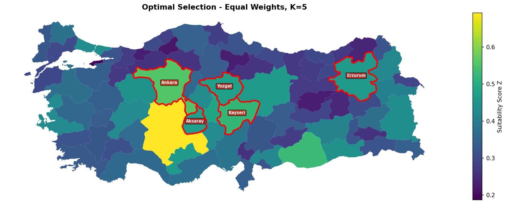

# Multi-Criteria Location Optimization for Data Center Placement in Türkiye

<details>
<summary>🇹🇷 Türkçe özet için tıklayın</summary>

Osmancan Sarı, Efe Karan Hacımustafaoğlu ve Yusuf Oğuz'un ortak projesi. Türkiye'nin 81 ilini, 5 kriterin ağırlıklı toplamıyla puanlayıp bir İkili Tamsayılı Programlama (BIP) modeliyle en uygun il setini seçen bir optimizasyon sistemi: arazi uygunluğu (SRTM eğim verisi), sismik güvenlik (AFAD PGA), işgücü yoğunluğu (TÜİK), yenilenebilir enerji potansiyeli (NASA POWER + TÜREB), soğutma verimliliği (MGM sıcaklık). 8 farklı resmi kaynaktan gerçek veri toplanıp işlendi.

**Model:** PuLP + CBC solver ile branch-and-bound, 81 ikili değişken, 1 saniyenin altında çözülüyor. 4 kısıt ailesi var: minimum mesafe (afet kurtarma amaçlı), sismik güvenlik eşiği, güney sınırına yakınlık yasağı (37. paralel yaklaşıklığıyla), ikili değişken kısıtı.

**Sonuç (eşit ağırlık, K=5):** Ankara, Kayseri, Yozgat, Aksaray, Erzurum seçiliyor. İlginç bir bulgu: en yüksek bireysel skora sahip il olan Konya (0.692), sınıra yakınlığı nedeniyle dışlanıyor. Ağırlıklar değiştirilince sonuç anlamlı şekilde kayıyor: sismik öncelik İç Anadolu'ya yoğunlaşıyor, soğutma önceliği doğuya (Erzurum/Kars/Ağrı) kayıyor, yenilenebilir enerji önceliği tek kıyı ilini (İzmir) sisteme sokuyor.

**Etkileşimli uygulama:** Streamlit dashboard'u, tüm ağırlıkları/kısıtları canlı ayarlayıp sonucu anında görmeyi sağlıyor.

</details>

---

A team project by Osmancan Sarı, Efe Karan Hacımustafaoğlu, and Yusuf Oğuz. Selecting the best set of Turkish provinces for data center investment by scoring all 81 on five weighted criteria and solving a Binary Integer Program (BIP) over the result.

## The five criteria

| Criterion | Symbol | Source | Notes |
|---|---|---|---|
| Land availability | F | NASA SRTM (~90m DEM) | Share of province area with slope below 5°; Konya leads with almost 30,000 km² of flat terrain |
| Seismic safety | P | AFAD Peak Ground Acceleration | Log-normalized and inverted (lower PGA = safer); ranges from 0.09g (Nevşehir) to 0.60g (Bingöl) |
| Labor density | L | TÜİK | Log-transformed working-age employed population; İstanbul leads (~7.6M employed) |
| Renewable energy potential | E | NASA POWER (solar) + TÜREB (wind) | Blended 60% solar / 40% wind; İzmir scores highest (0.89) on its 1,907 MW of installed wind capacity |
| Cooling efficiency | C | MGM | Inverted annual mean temperature; Ardahan scores 1.00 (4.3°C average), Mersin scores 0.00 (20.2°C) |

A separate cost estimate per province (construction baseline + local personnel cost + industrial electricity tariff, from TÜİK GDP and EPDK data) feeds an optional budget-constrained solving mode.

One notable pattern in the underlying data: labor density and cooling efficiency are negatively correlated (ρ = -0.45), since Türkiye's biggest labor markets tend to be its warmer cities. That tension is exactly what the optimization has to resolve.

## Model

**Suitability score:** `x_i = w1*F_i + w2*P_i + w3*L_i + w4*E_i + w5*C_i`, weights summing to 1.

**Objective:** maximize total suitability of the selected provinces, either picking a fixed count K (`sum(y_i) = K`) or filling a budget ceiling (`sum(c_i * y_i) <= B`).

**Constraints:**
- Minimum road distance between any two selected provinces (precomputed forbidden pairs from the KGM distance matrix, keeping the model linear instead of introducing quadratic pairwise-distance terms)
- A minimum total seismic-safety score across the selection
- A border-exclusion zone: provinces within a configurable distance of the ~37th parallel (the Syria/Iraq border) are excluded outright
- Binary domain on every decision variable

Solved with **PuLP + CBC** (branch-and-bound with cutting planes). With only 81 binary variables and fully linear constraints, CBC finds the provably optimal selection in well under a second, exact rather than heuristic, which is also why a genetic algorithm considered during planning was dropped in favor of an exact solver.

## Results

**Baseline (equal weights, K = 5):**

| Province | x_i | F | P | L | E | C |
|---|---:|---:|---:|---:|---:|---:|
| Ankara | 0.555 | 0.42 | 0.66 | 0.80 | 0.42 | 0.48 |
| Kayseri | 0.522 | 0.28 | 0.68 | 0.51 | 0.56 | 0.58 |
| Yozgat | 0.471 | 0.23 | 0.74 | 0.30 | 0.43 | 0.66 |
| Aksaray | 0.468 | 0.21 | 0.86 | 0.29 | 0.51 | 0.46 |
| Erzurum | 0.460 | 0.18 | 0.29 | 0.40 | 0.50 | 0.93 |

Total suitability Z = 2.476.



**The most interesting individual result isn't in the table.** Konya has the single highest suitability score of any province (x = 0.692), and it's on the map above as the bright yellow region right next to Aksaray, but it's never selected: its latitude places it inside the border-exclusion zone. A pure ranking would pick Konya; the constrained optimization correctly doesn't.

**Weight scenarios (K = 5, same constraints):**

| Scenario | Selected provinces | Total Z |
|---|---|---:|
| Equal weights | Ankara, Kayseri, Yozgat, Aksaray, Erzurum | 2.476 |
| Seismic priority (wP = 0.60) | Aksaray, Kırşehir, Ankara, Yozgat, Kayseri | 3.131 |
| Cooling priority (wC = 0.60) | Erzurum, Kars, Ağrı, Yozgat, Sivas | 3.123 |
| Renewable priority (wE = 0.60) | İzmir, Kayseri, Balıkesir, Van, Aksaray | 2.680 |

Each profile pulls the solution somewhere geographically distinct: seismic priority concentrates on central Anatolia's safest ground, cooling priority pushes east onto the high-altitude plateau (4.3-13.2°C average), and renewable priority is the only scenario that pulls in a coastal province (İzmir, for its wind and solar combined).

Constraints shape the outcome as much as the weights do. At the default 100 km minimum distance, 38 province pairs are mutually forbidden; raising it to 200 km pushes that past 150 pairs and forces the solver to spread out geographically (Ankara and Kırşehir, 186 km apart, can no longer both be picked). The border-exclusion zone alone removes 21 provinces from consideration at its default setting, including three strong multi-criteria performers (Konya, Şanlıurfa, Antalya).

## Interactive application

A Streamlit dashboard (`app.py`) exposes every tunable parameter: the five criterion weights (with quick presets for equal/seismic/cooling/renewable/land priority), the solar/wind blend, the land-slope threshold, the count-vs-budget solving mode, and all constraint parameters. Changing a slider and clicking "Solve!" reconstructs and re-solves the BIP in real time and updates the choropleth map.

## Repository structure

```
proje_dosyalari/
├── app.py                  Streamlit interactive dashboard
├── solver.py                BIP solver (PuLP + CBC)
├── dataframe.py              Data loader
├── distance.py               Distance constraint helper
├── provinces.py               Province ID mappings
├── notebook.ipynb            Full analysis notebook
├── docs/
│   ├── final_report.pdf        Full written report (methodology, results, limitations)
│   ├── project_proposal.pdf     Early-stage proposal
│   └── notebook.pdf             Exported notebook (PDF)
├── figures/                  Generated plots
│   ├── criterion_scores.png
│   ├── correlation_matrix.png
│   ├── suitability_map.png
│   ├── result_map.png
│   └── cbc_vs_greedy.png
├── data/
│   ├── processed/scores.csv        Merged scores (81 provinces)
│   ├── arazi_srtm/land.xlsx        F scores
│   ├── deprem_afad/seismic.xlsx    P scores
│   ├── isgücü_tuik/labor.xlsx      L scores
│   ├── enerji_nasa_tureb/energy.xlsx E scores
│   ├── sicaklik_mgm/cooling.xlsx   C scores
│   └── gelir_tuik/cost.xlsx        Cost estimates
├── scripts/
│   ├── fetch_land.py
│   ├── fetch_seismic.py
│   ├── fetch_labor.py
│   ├── fetch_solar.py
│   ├── fetch_wind.py
│   ├── fetch_energy.py
│   ├── fetch_cooling.py
│   ├── fetch_cost.py
│   └── build_scores.py
└── assets/
    └── gadm41_TUR.gpkg     GADM Turkey province boundaries
```

## Running the project

**Requirements:** Python 3.12, dependencies in `requirements.txt`

```bash
uv venv
uv pip install -r requirements.txt

# Run the interactive dashboard
streamlit run app.py

# Or open the analysis notebook
jupyter lab notebook.ipynb
```

## Data sources

- **NASA SRTM** (~90m resolution): digital elevation model for land-slope scoring
- **AFAD:** Peak Ground Acceleration, 10% exceedance probability in 50 years
- **TÜİK:** provincial employment and GDP
- **NASA POWER:** annual mean solar irradiance per province
- **TÜREB:** installed wind capacity by province (July 2022 report)
- **MGM:** annual mean temperature by province
- **KGM:** inter-provincial road distance matrix
- **GADM:** administrative boundaries (gadm.org)

## Limitations

The report is explicit about scope decisions: scores are computed at province-level granularity rather than per-parcel; youth-unemployment/NEET data was excluded from the labor score because its signal direction is ambiguous in the Turkish context; nuclear capacity was left out of the energy score since only one province currently has an operational site; and the model is fully deterministic, treating energy prices, seismic estimates, and demographics as fixed rather than uncertain. A Monte Carlo sensitivity analysis over these parameters is the most natural next step.

## Tools

Python, PuLP with the CBC solver for the BIP, Pandas for data handling, GeoPandas and Matplotlib for the choropleth maps, Streamlit for the interactive dashboard.
